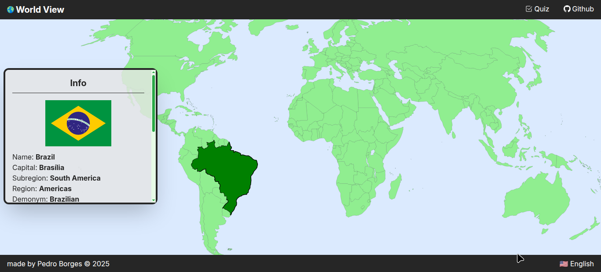

# World View




> World View is an web app that uses LLM and allows the user to learn about the countries of the world by clicking on their position on the map.

### Adjustments and improvements

The project is still in development and the next updates are directed to the following tasks:

- [ ] Translate the values of the returned json from Countries API
- [ ] Highlight regions and subregions
- [ ] Quiz mode

## Prerequisites

Before getting started, make sure you meet the following requirements for a Node.js project:

- You have the latest LTS version of Node.js and npm installed.
- You are using a compatible operating system (Windows, Linux, or macOS). All three are supported.
- You have read the relevant project documentation or setup guide.

## Installing it

To install it, follow these steps:

```bash
git clone https://github.com/dspedroborges/world-view
cd world-view
npm install
```

## Using it locally

To use it locally, follow these steps:

```bash
npm run dev
```

## Env

```
VITE_COUNTRIES_API_URL="/api-countries"
```

## Live Demo

You can try it live at: [Live Demo](https://worldviewproject.vercel.app/)

To run the project:

```bash
npm run build
```

## License

This project is under license. See the file [LICENSE](LICENSE.md) for more details.